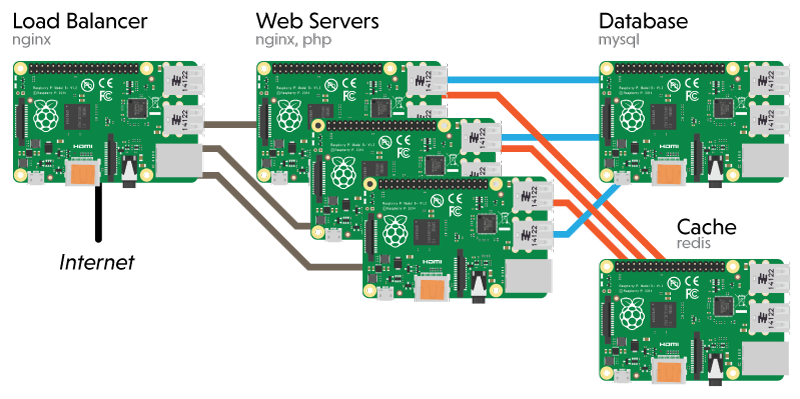

# Madmartigan
A Raspberry Pi Clustering Project.

## Summary
The [Raspberry Pi](http://raspberrypi.org) is a single-board computer developed in the the UK with the intention of promoting the teaching of basic computer science in schools. The small form factor and low cost of the Raspberry Pi have made it ideal for more advanced research projects as well.

By building a cluster of Raspberry Pi computers, one can design and test complicated network configurations and software solutions while emulating a larger scale network. This keeps such development off of the production servers, and allows for rapid prototyping in Linux systems without using additional IT resources. Building a similar system with full-size computer hardware would be extremely expensive and require a large amount of space and electricity to operate. Some examples of Raspberry Pi clusters built at different Universities are included in the references at the bottom of this page.

## Objectives
I intend to design and build a small cluster of Raspberry Pi computers and use the device for researching and developing advanced web serving solutions. The goal of this training and research is to develop systems and processes that may directly improve performance and reliability of the College's website for all campuses.

### Advanced hardware design / build
Using equipment at Tenth St Campus, a custom case will be designed and built to contain the computing hardware. New design and production techniques will be explored and documented through this process.

- **Case** to be designed with CAD tools, cut from acrylic on laser cutter
  - capacity for six Raspberry Pi 2 boards
  - appropriate ventilation / cooling
  - contain all wiring and accessories
    - usb charging device to power Pis
    - network cables, switch
  - each Pi gets a small protoboard with an RGB LED status light. This allows the device to *visualize* server activity while load balancing and performing other tasks.

See the [Bill of Materials](bom.md) for details on materials required for this project.

### Software testing, development
Once the Madmartigan device is built, it can be used to test and develop various types of networking software and solutions. I plan to complete and document self-directed study on the following topics:

#### Configuration Deployment with Ansible
Ansible is an open-source software platform for configuring and managing computers.

#### Load balancing with Drupal on Nginx
> Load balancing across multiple application instances is a commonly used technique for optimizing resource utilization, maximizing throughput, reducing latency, and ensuring fault-tolerant configurations.

>It is possible to use nginx as a very efficient HTTP load balancer to distribute traffic to several application servers and to improve performance, scalability and reliability of web applications with nginx.

#### Video Wall multi panel displays
Using a number of video displays, the cluster could be used to develop and demonstrate large scale display and technology.

#### Distributed digital signage systems
The device can be used to demonstrate and tune digital signage software for Raspberry Pi hardware. A distributed system wherein the signage assets are sourced from one server and distributed to other devices, reducing server and network load.

#### Data Structure Servers - Redis
From WikiPedia:

>Redis is a data structure server. It is open-source, networked, in-memory, and stores keys with optional durability. The development of Redis has been sponsored by Pivotal Software since May 2013; before that, it was sponsored by VMware. According to the monthly ranking by DB-Engines.com, Redis is the most popular key-value store.

## References
- http://www.midwesternmac.com/blogs/jeff-geerling/introducing-dramble-raspberry
- https://github.com/geerlingguy/raspberry-pi-dramble
- https://servercheck.in/blog/lessons-learned-building-raspberry-pi-dramble
- http://nginx.org/en/docs/http/load_balancing.html
- http://coen.boisestate.edu/ece/files/2013/05/Creating.a.Raspberry.Pi-Based.Beowulf.Cluster_v2.pdf
- http://www.southampton.ac.uk/~sjc/raspberrypi/pi_supercomputer_southampton.htm
- http://www.raspberrypi.org/forums/viewtopic.php?f=24&t=41449
- http://www.raspberrypi.org/video-wall/
